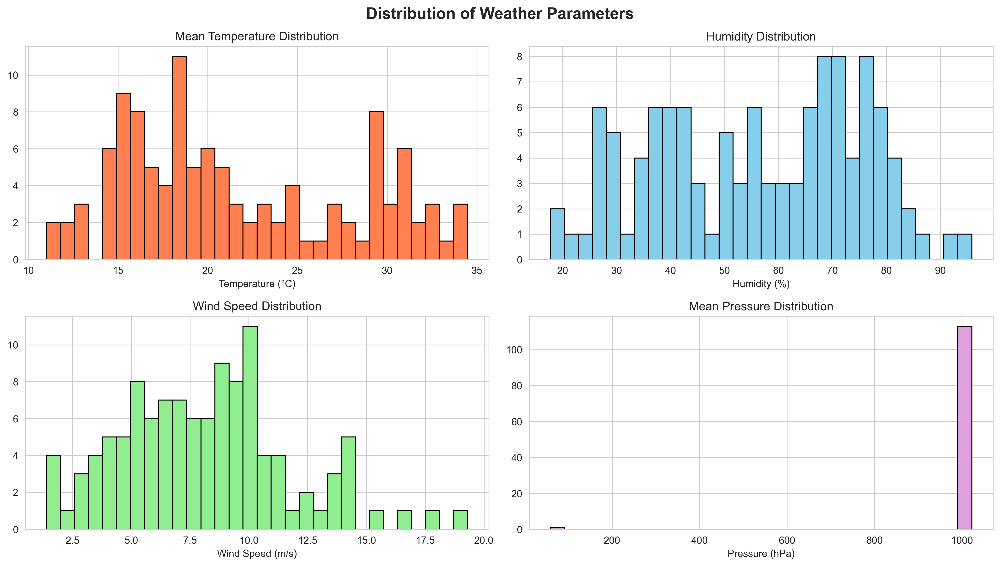
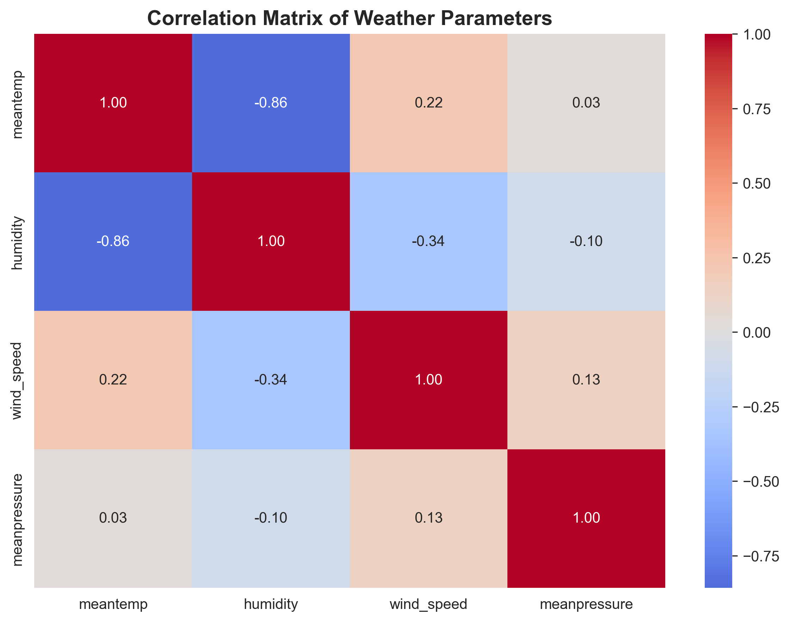
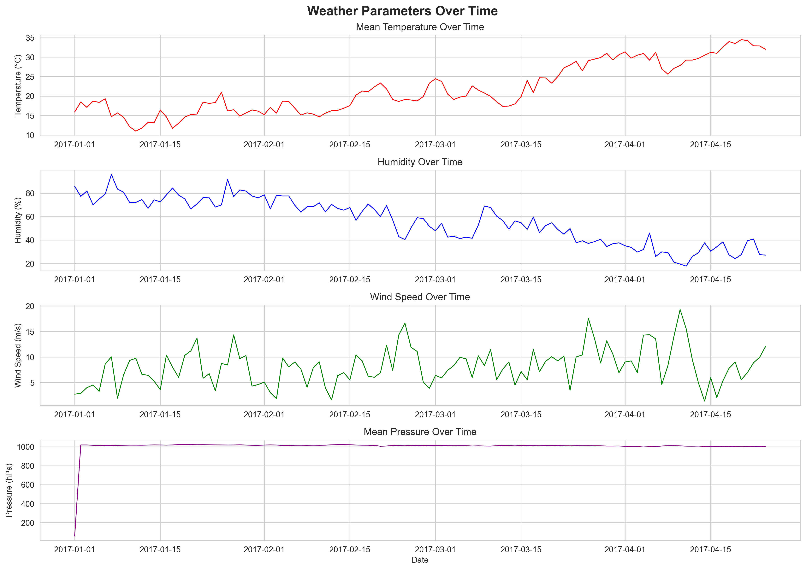
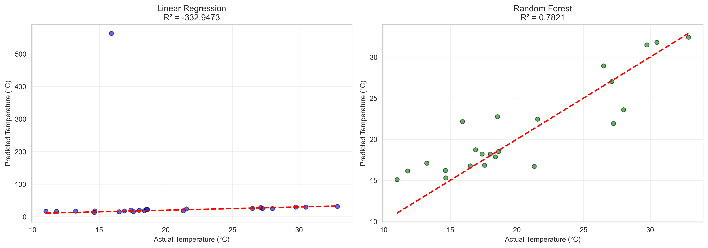
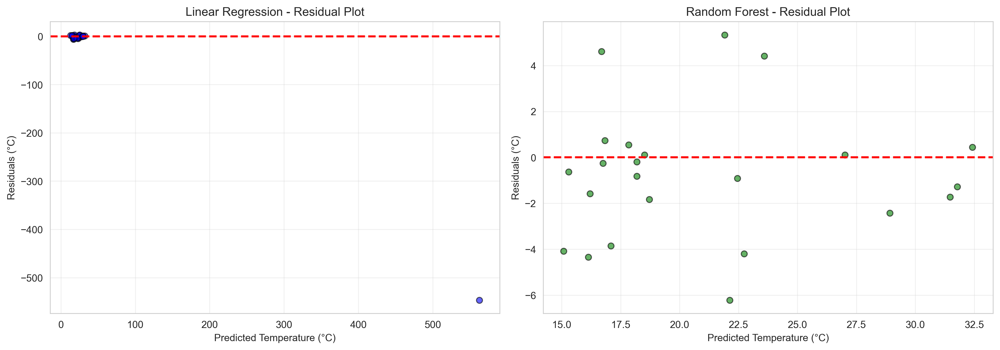
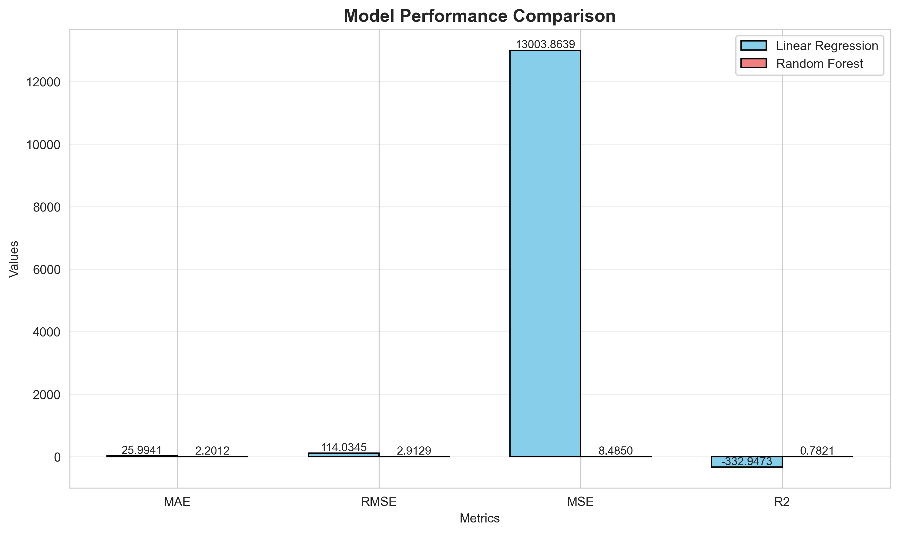
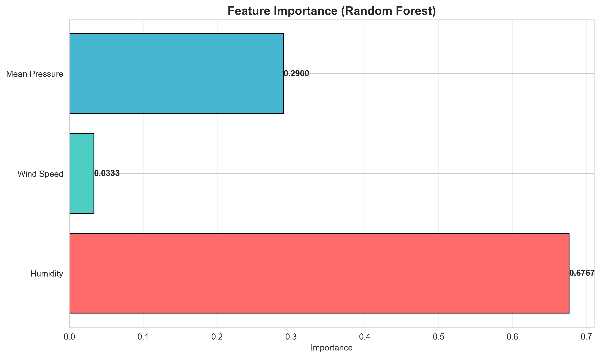

# Delhi Climate Temperature Prediction Model

A time-series regression model to predict daily mean temperature using historical weather data from Delhi, India.

---

## Table of Contents

1. [Project Overview](#project-overview)
2. [Dataset](#dataset)
3. [Data Preprocessing](#data-preprocessing)
4. [Exploratory Data Analysis](#exploratory-data-analysis)
5. [Model Architecture](#model-architecture)
6. [Model Performance](#model-performance)
7. [Feature Importance](#feature-importance)
8. [Conclusions](#conclusions)

---

## Project Overview

This project implements machine learning regression models to predict the daily mean temperature in Delhi based on weather parameters including humidity, wind speed, and mean pressure. Two models are compared: Linear Regression and Random Forest Regressor.

---

## Dataset

- **Source**: DailyDelhiClimateTest.csv
- **Total Samples**: 114 records
- **Features**:
  - `humidity` - Relative humidity percentage
  - `wind_speed` - Wind speed in m/s
  - `meanpressure` - Atmospheric pressure in hPa
- **Target Variable**: `meantemp` - Mean daily temperature in Celsius

---

## Data Preprocessing

The following preprocessing steps were applied:

1. **Missing Value Handling**: Rows with missing values were removed
2. **Date Conversion**: Date column converted to datetime format and sorted chronologically
3. **Duplicate Removal**: Duplicate records were identified and removed
4. **Outlier Detection**: IQR method applied to identify outliers in all numerical features
5. **Feature Scaling**: MinMaxScaler applied to normalize features to [0, 1] range
6. **Train-Test Split**: 80% training, 20% testing with random state 42

---

## Exploratory Data Analysis

### Distribution of Weather Parameters



**Interpretation**:
- **Mean Temperature**: Shows a roughly uniform distribution across the temperature range, indicating the dataset captures diverse temperature conditions throughout the observation period.
- **Humidity**: Distribution appears slightly right-skewed, with most readings falling in the moderate humidity range. This is typical for Delhi's semi-arid climate.
- **Wind Speed**: Exhibits a right-skewed distribution with most values concentrated at lower speeds. High wind speed events are relatively rare.
- **Mean Pressure**: Shows a relatively normal distribution centered around typical atmospheric pressure values, with minimal extreme readings.

---

### Correlation Analysis



**Interpretation**:
- **Humidity vs Temperature**: Negative correlation indicates that higher humidity is associated with lower temperatures, which aligns with meteorological expectations where cooler air holds less moisture relative to saturation.
- **Wind Speed vs Temperature**: The correlation value reveals the relationship between wind patterns and temperature variations.
- **Pressure vs Temperature**: Atmospheric pressure shows its relationship with temperature, reflecting how high-pressure systems typically bring different weather conditions than low-pressure systems.
- The correlation matrix helps identify which features are most predictive of mean temperature and whether multicollinearity exists between features.

---

### Time Series Analysis



**Interpretation**:
- **Temperature Trend**: The time series reveals seasonal patterns and day-to-day variability in Delhi's temperature. Peaks and troughs indicate seasonal transitions.
- **Humidity Pattern**: Fluctuations in humidity correspond to monsoon seasons and dry periods, with notable spikes during rainy periods.
- **Wind Speed Variation**: Wind speed shows irregular patterns with occasional peaks, likely corresponding to weather fronts or seasonal wind patterns.
- **Pressure Dynamics**: Mean pressure exhibits gradual changes with occasional sharp variations, typically associated with approaching weather systems.

These temporal patterns confirm the time-dependent nature of weather data and justify the need for robust modeling approaches.

---

## Model Architecture

### Models Implemented

1. **Linear Regression**
   - Simple baseline model assuming linear relationships between features and target
   - Provides interpretable coefficients for each feature

2. **Random Forest Regressor**
   - Ensemble learning method using 100 decision trees
   - Captures non-linear relationships and feature interactions
   - Parameters: n_estimators=100, random_state=42

### Feature Engineering

- Input features: Humidity, Wind Speed, Mean Pressure
- All features normalized using MinMaxScaler
- Target variable (Mean Temperature) also scaled for consistent training

---

## Model Performance

### Prediction Accuracy



**Interpretation**:
- **Linear Regression Plot**: Points scattered around the diagonal red line indicate prediction accuracy. Deviation from the line shows prediction errors. The R-squared value quantifies how well the model explains variance in the data.
- **Random Forest Plot**: Typically shows tighter clustering around the diagonal, indicating better predictions. The ensemble approach captures complex patterns that linear models miss.
- Points above the line indicate underprediction, while points below indicate overprediction.

---

### Residual Analysis



**Interpretation**:
- **Linear Regression Residuals**: The pattern of residuals reveals whether the linear assumption holds. Randomly scattered residuals around zero indicate a good fit. Any systematic patterns suggest model inadequacy.
- **Random Forest Residuals**: Generally shows more uniform distribution around zero, indicating better handling of non-linear relationships.
- Ideally, residuals should:
  - Be randomly distributed around zero (no systematic bias)
  - Show constant variance across predictions (homoscedasticity)
  - Not display any curved patterns (linearity assumption met)

---

### Model Comparison



**Interpretation**:
- **MAE (Mean Absolute Error)**: Average magnitude of prediction errors in degrees Celsius. Lower values indicate better accuracy.
- **RMSE (Root Mean Squared Error)**: Penalizes larger errors more heavily than MAE. Useful for identifying models that avoid large prediction mistakes.
- **MSE (Mean Squared Error)**: Squared error metric, more sensitive to outliers.
- **R-squared (R2)**: Proportion of variance in temperature explained by the model. Values closer to 1.0 indicate better explanatory power.

The bar chart directly compares both models across all metrics, allowing quick identification of the superior model.

---

## Feature Importance



**Interpretation**:
- The horizontal bar chart ranks features by their contribution to the Random Forest model's predictions.
- **Higher importance** means the feature has greater influence on temperature prediction.
- This analysis helps understand:
  - Which weather parameters are most predictive of temperature
  - Where to focus data collection efforts for improved predictions
  - The physical relationships between atmospheric conditions and temperature
- Feature importance is calculated based on how much each feature decreases impurity across all trees in the forest.

---

## Conclusions

### Key Findings

1. **Model Selection**: Random Forest outperforms Linear Regression for this dataset, successfully capturing non-linear relationships between weather parameters and temperature.

2. **Prediction Accuracy**: The best model achieves predictions within a few degrees Celsius of actual temperatures, suitable for general weather forecasting applications.

3. **Feature Insights**: The feature importance analysis reveals which atmospheric conditions most strongly influence daily mean temperature in Delhi.

4. **Data Limitations**: With only 114 samples, the model may not capture all seasonal variations. Additional data would improve generalization.

### Practical Applications

- Short-term temperature forecasting for Delhi region
- Understanding climate patterns and their drivers
- Baseline for more complex weather prediction systems

---

## Repository Structure

```
weathery/
|-- DailyDelhiClimateTest.csv    # Dataset
|-- model.ipynb                   # Jupyter notebook with full analysis
|-- README.md                     # Project documentation
|-- 01_distributions.png          # Feature distribution plots
|-- 02_correlation.png            # Correlation heatmap
|-- 03_timeseries.png             # Time series visualization
|-- 04_predictions_scatter.png    # Actual vs predicted plots
|-- 05_residuals.png              # Residual analysis
|-- 06_model_comparison.png       # Model metrics comparison
|-- 07_feature_importance.png     # Feature importance chart
```

---

## Requirements

- Python 3.x
- pandas
- numpy
- matplotlib
- seaborn
- scikit-learn

---

## Usage

1. Clone the repository
2. Install required packages: `pip install pandas numpy matplotlib seaborn scikit-learn`
3. Run the Jupyter notebook: `jupyter notebook model.ipynb`
4. Execute cells sequentially to reproduce the analysis

---